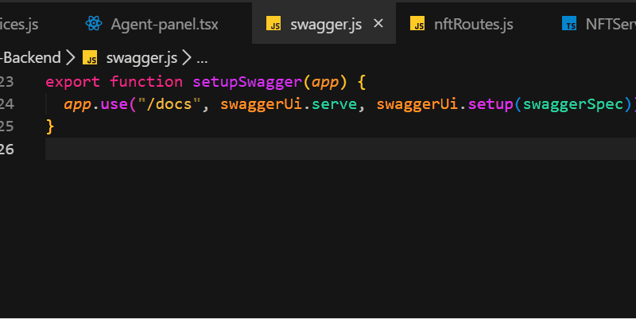
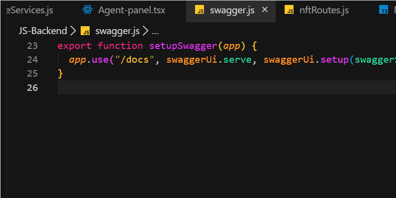

# LazyDocs

This is the README for **LazyDocs**, a VS Code extension that automates documentation and commit message generation.

---

## ✨ Features

- **Auto-Generate Documentation**  
  LazyDocs scans your workspace and produces clean, structured documentation with one command.  

- **VS Code Integration**  
  Run from the Command Palette: `LazyDocs: GenerateDocs`  

- **Generate Commit Messages**  
  Automatically generate concise, descriptive commit messages based on your changes — making version control faster and cleaner.  
  Run from the Command Palette: `LazyDocs: Auto-Generate Commit Message`

### Screenshots / GIFs

#### Generate Docs  
  

#### Generate Commit  
    

---

## ⚙️ Requirements

- **VS Code Version**  
  Requires VS Code `1.103.0` or higher.  

- **Node.js (Optional)**  
  Needed only if your extension spawns Node scripts for extra processing (e.g. Node 18+).  

- **Permissions**  
  - Read access to the current workspace to scan files.  
  - Internet access for documentation generation (LazyDocs utilises Deepseek).  

### Installation

1. Install LazyDocs from the VS Code Marketplace.  
2. Reload VS Code.  
3. Open the Command Palette (`Ctrl+Shift+P` / `Cmd+Shift+P`) and run `LazyDocs: GenerateDocs`.

---

## 🐞 Known Issues

- Internet connection is required for documentation generation.

---

## 📝 Release Notes

### 1.0.0 🎉

**Automatic Docs Generation**  
LazyDocs scans your project and instantly generates clean documentation.

**Smart Detection of Project Features**  
Automatically identifies key features of a project, such as the web technologies used.

---

## 📬 Contact

I’d love to hear your feedback, ideas, or collaboration requests for LazyDocs.  
Feel free to reach out:

- **Email:** [frankez478@example.com](mailto:frankez478@example.com)  
- **GitHub:** [github.com/FrankLayza](https://github.com/FrankLayza)  
- **Twitter/X:** [@FrankLayza](https://twitter.com/FrankLayza)

> 💡 *If you’re using LazyDocs in your projects, tag me on X — I’m always happy to see it in action!*

---

## 🙏 Special Thanks

A big thanks to **[FortexFreddie](https://github.com/FortexFreddie)** for contributing to the Commit Generation feature!

---

**Enjoy!**
